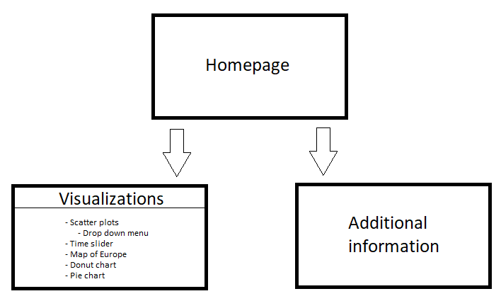
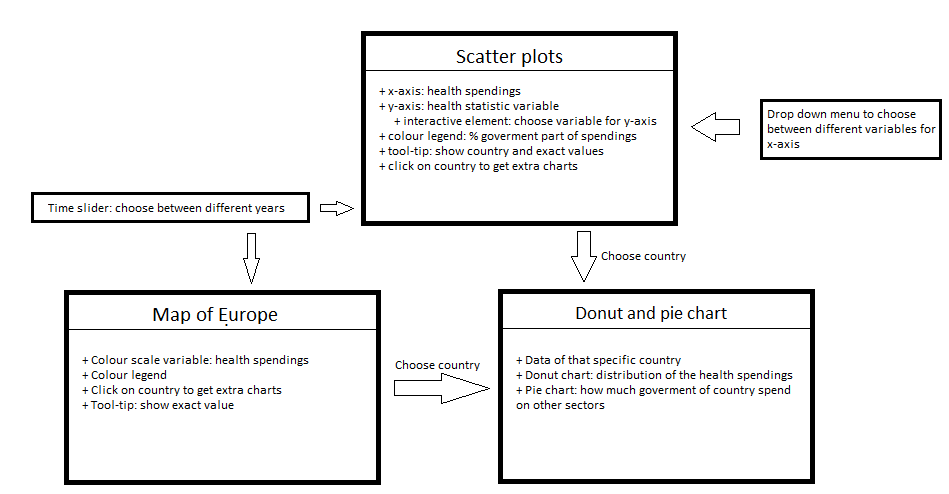

# Design Document
Name: Teska Vaessen

Student number: 11046341

## Data sources
I will need the following data sources:
+ [Health spendings](https://data.oecd.org/healthres/health-spending.htm)
+ [General government spending](https://data.oecd.org/gga/general-government-spending.htm#indicator-chart)
+ [Alcohol consumption](https://data.oecd.org/healthrisk/alcohol-consumption.htm)
+ [Smokers](https://data.oecd.org/healthrisk/daily-smokers.htm#indicator-chart)
+ [Life expectancy](https://data.oecd.org/healthstat/life-expectancy-at-birth.htm)
+ [Potential years of life lost](https://data.oecd.org/healthstat/potential-years-of-life-lost.htm#indicator-chart)
+ [Overweight](https://data.oecd.org/healthrisk/overweight-or-obese-population.htm)

These are all CSV-files and I will transform and convert them in python into one JSON file with the variables I need. I need to make sure the JSON file is handy to use to make my visualizations.

## Diagram and technical components
My website will have the following pages:

The visualization page will have the following components:

The scatter plot and drop down menu:

This is a scatter plot with a drop down menu where you can choose between the different kind of health variables for the y-axis. When you click on a country you will see a donut chart and a pie chart for that specific country. For this I will need d3, d3-tip and d3-legend. For the drop down menu I will also need to use bootstrap.

The map of Europe:

This is a map of Europe. When you click on a country you will see a donut chart and a pie chart. For the map I will need TopojSON, D3 and D3-legend.

The donut and pie chart:

For the donut and pie chart I will need D3 and D3-tip.

The time slider:

With this time slider you can update the data for all the visualizations with the year you want to see. For the time slider I will also need to use D3 and bootstrap.

### External components and D3 plugins
+ D3
+ D3-tip
+ D3-legend
+ TopoJSON
+ Bootstrap
