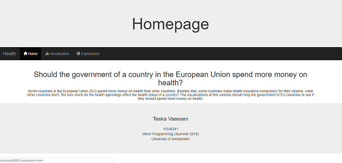

# Process book
Teska Vaessen, 11046341

## Day 1 (03-06-2019)
Finished the first draft of my proposal. I chose to make the relationship between the health spendings and health statistic variables as the "head" visualization in stead of the map of Europe, since this relationship is more important to answer my question. The map shows more specific details.

## Day 2 (04-06-2019)
Finished my design document. I updated it after the meeting with my group and assistant. I added some extra interactive elements between the different visualizations, since this was not enough. We also came up with some extra optional elements to add if I have enough time.

Also started making my prototype of the website. Created a homepage, a page for my visualizations and a page for some explanation. I added a navigation bar so you can easily switch between the different pages. I chose to make different pages to get a clear overview instead of all the information at one page. This will give more clearity for the user.

## Day 3 (05-06-2019)
During the standup we discussed my project and they gave me the idea to also highlight a country in either the scatter plot or the map when you click on a country in the other visualization. I will keep this in mind as an optional feature.
They also gave me the idea that I could visualize the scatter plot and the map of Europe next to eachother, so that it is easy to compare. So I will implement this in my website.

I started with reformatting my data. I had an idea how I wanted my JSON file for the data and I wanted to make this in python, but I found out this was hard. I got the tip from a fellow student to finish my JSON file in JavaScript, because there it is easier to loop over objects.
