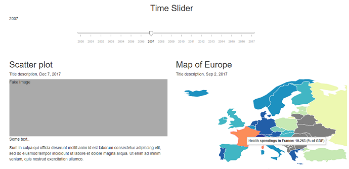
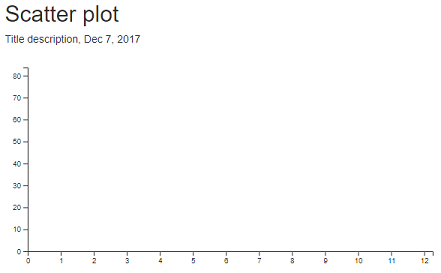
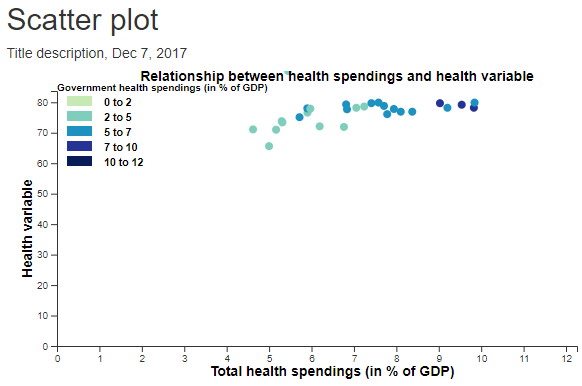
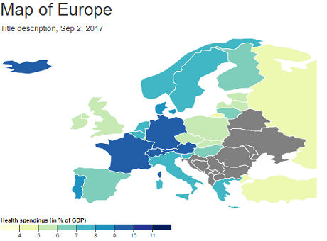
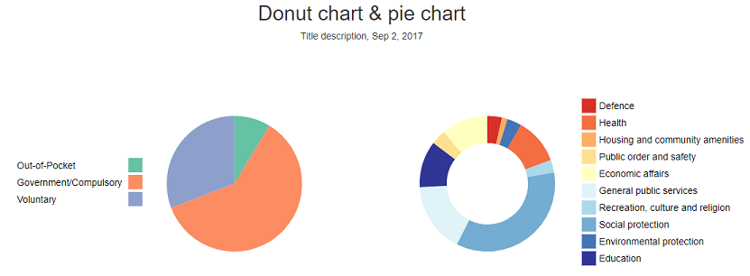
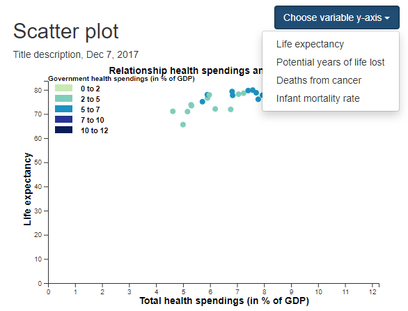
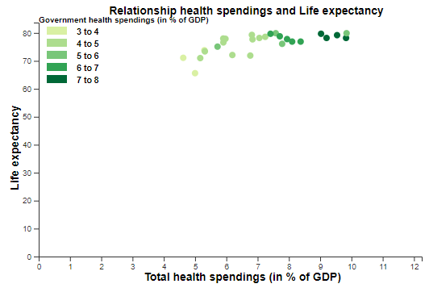
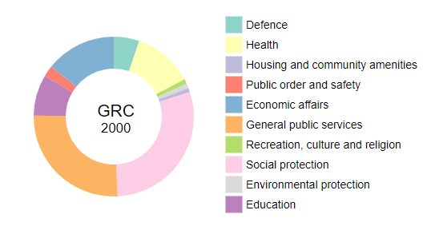

# Process book
Teska Vaessen, 11046341

## Day 1 (03-06-2019)
Finished the first draft of my proposal. I chose to make the relationship between the health spendings and health statistic variables as the "head" visualization in stead of the map of Europe, since this relationship is more important to answer my question. The map shows more specific details.

## Day 2 (04-06-2019)
Finished my design document. I updated it after the meeting with my group and assistant. I added some extra interactive elements between the different visualizations, since this was not enough. We also came up with some extra optional elements to add if I have enough time.

Also started making my prototype of the website. Created a homepage, a page for my visualizations and a page for some explanation. I added a navigation bar so you can easily switch between the different pages. I chose to make different pages to get a clear overview instead of all the information at one page. This will give more clearity for the user. I never made a html page with bootstrap before, now I learned how to do this.

## Day 3 (05-06-2019)
During the standup we discussed my project and they gave me the idea to also highlight a country in either the scatter plot or the map when you click on a country in the other visualization. I will keep this in mind as an optional feature.
They also gave me the idea that I could visualize the scatter plot and the map of Europe next to eachother, so that it is easy to compare. So I will implement this in my website.

I started with reformatting my data. I had an idea how I wanted my JSON file for the data and I wanted to make this in python, but I found out this was hard. I got the tip from a fellow student to finish my JSON file in JavaScript, because there it is easier to loop over objects. I think this will be very useful for me to do, since I never formatted data in JavaScript before, so I will learn how to do this.

## Day 4 (06-06-2019)
I have a lot of struggles with reformatting my data (it will take me more time than expected). My fellow students (Thomas and Enrikos) at the standup told me to first reformat a part of the data and already start with that data. Then I am sure that it will be okay to do it with the rest of the data, since all the datasets are in the same format. I thought this was smart.

I also finished the set-up of my website. As I got the feedback from yesterday, I made two columns to show my scatter plot and map of Europe next to eachother.

## Day 5 (07-06-2019)
Today I had some struggle with linking my html and javascript code. I wanted my html code in a seperate folder 'html' in the folder 'scripts'. I could not link my html and javascript this way, so I got the tip to put all my html code in the folder 'scripts' and not in a seperate folder. This way I can link the html and javascript.

I also added the world map to my page (see picture). I still need to zoom in on Europe, since I only have the data from Europe. I don't know how I will do this yet, but I will find this out after the weekend.

## Day 6 (11-06-2019)
Today I tried to zoom in on my world map to show only the countries of Europe. This was harder than I thought, since there is no clear example on the internet, but I fixed it. It now looks like this:

During the standup Pascalle gave me the feedback to have a look if I can delete the countries which are not from Europe, since you can still see some of those countries. I will keep this in mind, since I think that will look nicer.

## Day 7 (12-06-2019)
During the stand-up everyone told me to really get my data ready. I worked on it all day, but I was in the queue for questions for a long time. Nigel helped me with my problem and now my data is ready for the Europe map. So at the end of the day I started adding the colors of the countries and I also deleted the non-European countries which were still visible on the map (see feedback of day 6). I added a tip to the countries, so you can see the exact number of health spendings (in % of the GDP) when you hover over the country (not visible in this picture).

This is the map for the year 2000. I chose this color range, since it is color blind safe and I think that blue fits the theme "health". I also consired red colors, but it was a little bit too heavy. It would also be weird to choose very gay colours, since it is about health. I am still in doubt if I should do the visualization for whole Europe or just for the European Union, since now a lot of countries don't have data (see the grey countries). I will ask for feedback about this problem tomorrow at the standup.

Tomorrow I want to add the time slider, so you can switch between the different years on the map of Europe. I also want to start my scatter plot.

## Day 8 (13-06-2019)
Today I added the time slider and let the map of Europe update with the new year. What I still don't like about it, is that when I resize my window, the text 'Time slider' resizes with it, but the time slider it self doesn't. Also the current year is now in the top left corner. I was not able to replace it today, but I don't think where it is now looks good, so I will need to replace it later.

I also started creating the legend of the world map, but it is not working yet and I don't know why.

## Day 9 (14-06-2019)
At the mentor meeting I got the feedback to keep the map of Europe as it is, since if you only do the European Union you will still miss some countries. So I will keep all these countries, even though a lot of East-Europe is missing. I think this is good feedback, I learned that it is okay to have some missing data. You will always have this.

Today I tried to fix my scatter plot. I got the axes of the scatter plot, but somehow the circles don't work. They also won't appear in my html. I worked on this all day, but I couldn't fix it. It seems like the selectAll function does not work. I will ask this after the weekend, because I really don't know what to do.

## Day 10 (17-06-2019)
I started my pie chart today. First I created the pie chart for the distribution of the health spendings. This looks like this now:

I don't like the colors of the chart, but I am not sure if I should choose the same colours as for my map of Europe or if I should use other colors. I will ask for feedback at the stand up tomorrow. I also need to add a tooltip (started this but the tooltip showed up at the wrong position) and I need to add a legend and a title.

Besides that I finally got the help I needed for my scatter plot. Apparently the data was not in the right format to make a scatter plot. Jasper helped me with this. This was a good learning point, since now I know I always have to take a look at my data, before starting with a new visualization. Every visualization is different and the data needs to be in another format. Now it took me a lot of time, which was not necessary. My scatter plot looks like this:

As you can see I already added colors to the dots including color legend. I used the same colors as my map of Europe, but I have the same issue with this as with the pie chart if I should use other colors. I also already added a tooltip (not visible in the picture). As you can see in the picture there is one dot outside the scatter plot (in the title). This is a dot from a country which has not that variable of that specific variable in that specific year. I am not sure what to do with these missing data points. I will think about this.

## Day 11 (18-06-2019)
Today I fixed the legend for my Europe map. I got the tip that it didn't work, because it was not in a SVG. So I added a SVG and now the legend works. Before I didn't realize that visualizations (even legends) always need to be in a SVG. It took me a lot of time, which was not necessary but I won't make the same mistake again.

I also fixed the tooltip for the pie chart. I still don't really like the style of it, since it is a bit plain and boring, but at least it is at the right place. I will make the tooltip look nicer if I have time left. Besides that I added the donut chart. I also added the legends of both charts. I don't like the colors I have now, but I will think about the colors later. I never made a donut chart before and it took me a lot of time. In the end I found out that I made my inner radius the same as my outer radius. That was why it did not show my donut chart on screen...

I decided to put the charts next to each other and the legends on the other side of the chart. I thought this was the most clear position.

I also linked the pie charts to the time slider and the map of Europe. Some times it works and some times it doesn't. Also the update function does not work well, since the new charts will appear below the old charts. I will try to fix this tomorrow.

## Day 12 (19-06-2019)
Today I focussed on fixing the update of the pie charts. I figured out that the structure of my functions and scripts was really unfortunate. So I rearranged my structure of scripts. I got the tip to create a 'main javascript' in which I will call all my other functions. The next time I start a big project like this, I know I have to start with an arranged script and not just start and fix it later, because now it took me a lot of unnecessary time.

After I fixed the structure of my scripts I let the update of my pie charts work. I still don't like the transition of the update so I will take a look at this later.

## Day 13 (20-06-2019)
I worked for a long time today on the transition of the pie charts. Nigel helped me a lot but we could not figure out what is going wrong, so it still does not work. I decided to work on my scatter plot, since I already wasted a lot of time.

I added the drop down menu for the different variables of my scatter plot. I found out that I had no data for any of these variables for the year 2017. So that's why I decided to drop the year 2017, since my storytelling will make no sense for the year 2017 if I can make no scatter plot of those variables.

This is my drop down menu for the scatter plot. The only problem is that I can't save the health variable you choose with the menu. So I can't give the right variable to the time slider, so when I update the year it can't find the right health variable. I will try to fix this tomorrow.
I also added that when you click on a country dot in the scatter plot, that the piecharts also update. So now you can update the pie charts with the map of Europe and with the scatter plot. This dot also turns bigger when you click on it. When you click on a country in the worldmap, that country in the scatter plot turns big. So know the world map and the scatter plot are also linked.

## Day 14 (21-06-2019)
Today I first focused again on the transition of the pie charts. I made the update function work, but it is still not in a nice transformation.

After that I also fixed the drop down menu. Now all my linked views work, so my Beta version is done. I also decided to change the colors of the scatter plot, since now they were the same as my map of Europe. My scatter plot now looks like this:

These colors still match with my map of Europe, but they are not the same.

I also added that you can see the current country and the current year in the donut chart. Now you can only see the country code and not the whole country name. This is because the whole names are not in my dataset. If I have extra time next week, I will try to add these to my dataset with another dataset. But next week I first want to focus on nice transitions.

## Day 15 (24-06-2019)
Today I made sure that when you click on a country that has no data available of the government spendings, that the user gets a message that there is no data available. I also rounded the government spendings data up to 3 decimals, since before there were 6 decimals, which is a lot.

I also fixed the transitions of the scatter plot, so now the update of the scatter plot looks nice. Before this I updated the scatter plot by deleting the old scatter plot, and adding a new one. But now it is better.

I got the feedback that I really should add the names of the countries, since it looks nicer than showing the country code. So I downloaded a dataset with the country names and added it to my dataset. Now in the tooltip and pie chart, you can see the name of the whole country, instead of the country code.

## Day 16 (25-06-2019)
Today I faced a lot of problems. I found out that my the update of my scatter plot did not work and the update of my pie chart was also still not nice. Jasper explained to me better how update functions in D3 work. So together with him I managed to fix the update of my pie charts. After I fixed that, I found out that my scatter plot update was not working if there were countries missing. But since I understood the update functions better, I managed to fix that problem. After that I tried to update my map of Europe in a nicer way, since first I updated by deleting the old map and adding a new one. During the course I learned how to find standard programming functions online, so I found a functions which updates the map of Europe. First I thought it was working but later I found out that I could not go back to the year 2000 (the default year). This was because a overwrited my dataset. I had to take a lot at all my code to found where I did this. After a lot of time I fixed the problem. I learned that I never have to overwrite my dataset again and always check this.

So today I did not much for the front of my visualizations, but I fixed a lot of the background.

## Day 17 (26-06-2019)
