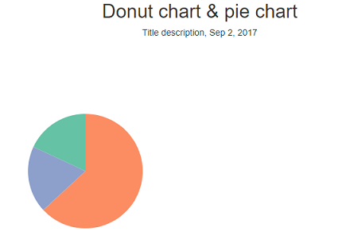

# Process book
Teska Vaessen, 11046341

## Day 1 (03-06-2019)
Finished the first draft of my proposal. I chose to make the relationship between the health spendings and health statistic variables as the "head" visualization in stead of the map of Europe, since this relationship is more important to answer my question. The map shows more specific details.

## Day 2 (04-06-2019)
Finished my design document. I updated it after the meeting with my group and assistant. I added some extra interactive elements between the different visualizations, since this was not enough. We also came up with some extra optional elements to add if I have enough time.

Also started making my prototype of the website. Created a homepage, a page for my visualizations and a page for some explanation. I added a navigation bar so you can easily switch between the different pages. I chose to make different pages to get a clear overview instead of all the information at one page. This will give more clearity for the user.

## Day 3 (05-06-2019)
During the standup we discussed my project and they gave me the idea to also highlight a country in either the scatter plot or the map when you click on a country in the other visualization. I will keep this in mind as an optional feature.
They also gave me the idea that I could visualize the scatter plot and the map of Europe next to eachother, so that it is easy to compare. So I will implement this in my website.

I started with reformatting my data. I had an idea how I wanted my JSON file for the data and I wanted to make this in python, but I found out this was hard. I got the tip from a fellow student to finish my JSON file in JavaScript, because there it is easier to loop over objects.

## Day 4 (06-06-2019)
I have some struggles with reformatting my data (it will take me more time than expected). My fellow students (Thomas and Enrikos) at the standup told me to first reformat a part of data and already start with that data. Then I am sure that it will be okay to do it with the rest of the data, since all the datasets are in the same format.

I also finished the set-up of my website. As I got the feedback from yesterday, I made two columns to show my scatter plot and map of Europe next to eachother.

## Day 5 (07-06-2019)
Today I had some struggle with linking my html and javascript code. I wanted my html code in a seperate folder 'html' in the folder 'scripts'. I could not link my html and javascript this way, so I got the tip to put all my html code in the folder 'scripts' and not in a seperate folder. This way I can link the html and javascript.

I also added the world map to my page (see picture). I still need to zoom in on Europe, since I only have the data from the European Union. I don't know how I will do this yet, but I will find this out after the weekend.

## Day 6 (11-06-2019)
Today I tried to zoom in on my world map to show only the countries of Europe. This was harder than I thought, but I fixed it. It now looks like this:

During the standup Pascalle gave me the feedback to have a look if I can delete the countries which are not from Europe, since you can still see some of those countries. I will keep this in mind, since I think that will look nicer.

## Day 7 (12-06-2019)
During the stand-up everyone told me to really get my data ready. I worked on it all day, but I was in the queue for questions for a long time. Nigel helped me with my problem and now my data is ready for the Europe map. So at the end of the day I started adding the colors of the countries and I also deleted the non-European countries which were still visible on the map (see feedback of day 6). I added a tip to the countries, so you can see the exact number of health spendings (in % of the GDP) when you hover over the country (not visible in this picture).

This is the map for the year 2000. I chose this color range, since it is color blind safe and I think that blue fits the theme "health". I also consired red colors, but it was a little bit too heavy. It would also be weird to choose very gay colours. I am still in doubt if I should do the visualization for whole Europe or just for the European Union, since now a lot of countries don't have data (see the grey countries). I will ask for feedback about this problem tomorrow at the standup.

Tomorrow I want to add the time slider, so you can switch between the different years on the map of Europe. I also want to start my scatter plot.

## Day 8 (13-06-2019)
Today I added the time slider and let the map of Europe update with the new year. What I still don't like about it, is that when I resize my window, the text 'Time slider' resizes with it, but the time slider it self doesn't. Also the current year is now in the top left corner. I was not able to replace it today, but I don't think where it is now looks good, so I will need to replace it later.

I also started creating the legend of the world map, but it is not working yet.

## Day 9 (14-06-2019)
At the mentor meeting I got the feedback to keep the map of Europe as it is, since if you only do the European Union you will still miss some countries. So I will keep all these countries, even though a lot of East-Europe is missing.

Today I tried to fix my scatter plot. I got the axes of the scatter plot, but somehow the circles don't work. They also won't appear in my html. I worked on this all day, but I couldn't fix it. It seems like the selectAll function does not work. I will ask this after the weekend, because I really don't know what to do.

## Day 10 (17-06-2019)
I started my pie chart today. First I created the pie chart for the distribution of the health spendings. This looks like this now:

I don't like the colors of the chart, but I am not sure if I should choose the same colours as for mu map of Europe or if I should use other colors. I will ask for feedback at the stand up tomorrow. I also need to add a tooltip (started this but the tooltip showed up at the wrong position) and I need to add a legend and a title.

Besides that I finally got the help I needed for my scatter plot. Apparently the data was not in the right format to make a scatter plot. Jasper helped me with this. Now my scatter plot looks like this:

As you can see I already added colors to the dots including color legend. I used the same colors as my map of Europe, but I have the same issue with this as with the pie chart if I should use other colors. I also already added a tooltip (not visible in the picture). As you can see in the picture there is one dot outside the scatter plot (in the title). This is a dot from a country which has not that variable of that specific variable in that specific year. I am not sure what to do with these missing data points. I will think about this.
