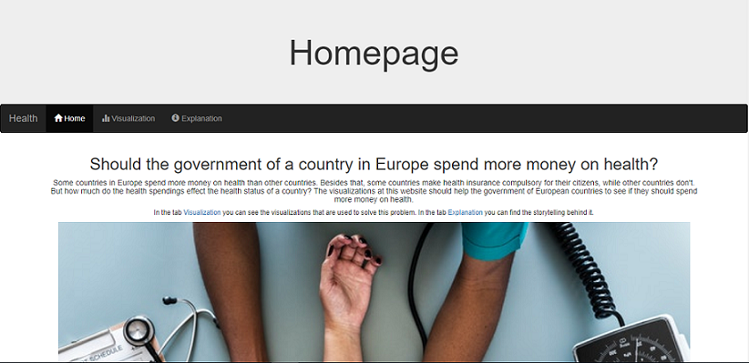
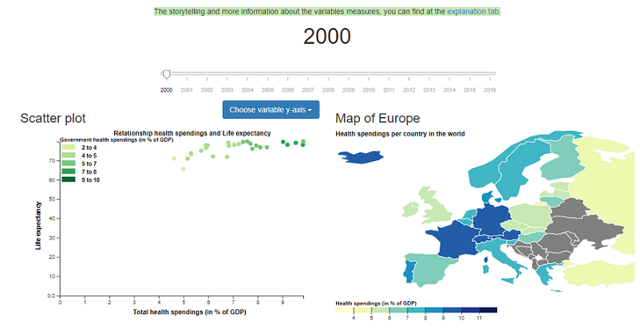
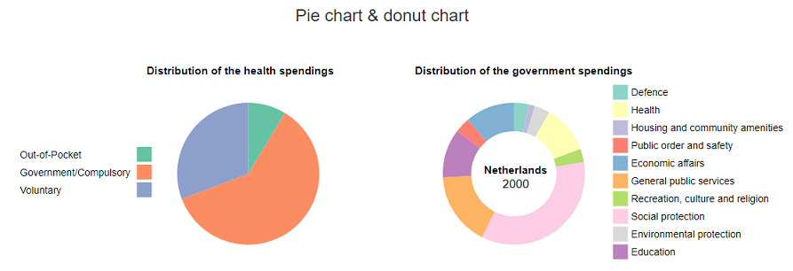
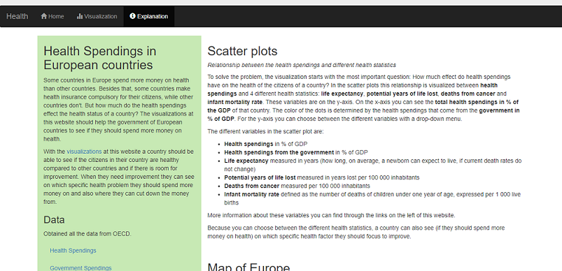

# ProgrammeerProject
Minor Programming 
Name: Teska Vaessen 
Student number: 11046341

## Introduction & purpose
##### Should the government of a country in Europe spend more money on health?
Some countries in Europe spend more money on health than other countries. Besides that, some countries make health insurance compulsory for their citizens, while other countries don't. But how much do the health spendings effect the health status of a country? The visualizations at this website should help the government of European countries to see if they should spend more money on health. And if so, where they can cut down the money from and on which specific health statistic they should spend more money.

## Website
Website link: [Click here](https://teskav.github.io/ProgrammeerProject/)
Project video:

#### Homepage
When you come on my website, you start at my homepage.

Here there is an introduction to the problem.

#### Visualization
When you click on Visualization in the menu, you come at the visualization page.

On top you can see the time slider. With this you can choose between different years from 2000 to 2016 for all the different visualizations. 
Below the time slider, on the left, you see the scatter plot. With a drop down menu you can choose the variable for the y-axis. 
Next to the scatter plot there is the map of Europe, which shows in the colours of the country the health spendings of that country. When you click on a country in the map, the dot in the scatter plot of that country turns bigger.

Below the scatter plot and the map, there are the pie chart and the donut chart. These charts update by clicking on a country in either the scatter plot or in the map.

All the visualizations update when you change the year with the time slider.

#### Explanation
When you click on the Explanation tab in the menu, you get more information about the story telling and the different kind of variables and the data.

## Sources of external code
+ [Time slider](https://unpkg.com/d3-simple-slider)
+ [Map of Europe](https://datamaps.github.io/)
+ [TopoJSON](//cdnjs.cloudflare.com/ajax/libs/topojson/1.6.9/topojson.min.js)
+ [Map legend](https://bl.ocks.org/mbostock/4573883)
+ [Tooltip](https://cdnjs.cloudflare.com/ajax/libs/d3-tip/0.7.1/d3-tip.min.js)
+ [Scatter plot legend](https://bl.ocks.org/zanarmstrong/0b6276e033142ce95f7f374e20f1c1a7)
+ [Pie chart legend](https://codepen.io/thecraftycoderpdx/pen/jZyzKo)
+ [Circle highlight](https://stackoverflow.com/questions/37732166/how-to-make-scatterplot-highlight-data-on-click)
+ [Picture homepage](https://www.pexels.com/photo/person-using-black-blood-pressure-monitor-905874/)
+ [Bootstrap](https://maxcdn.bootstrapcdn.com/bootstrap/3.4.0/js/bootstrap.min.js)
