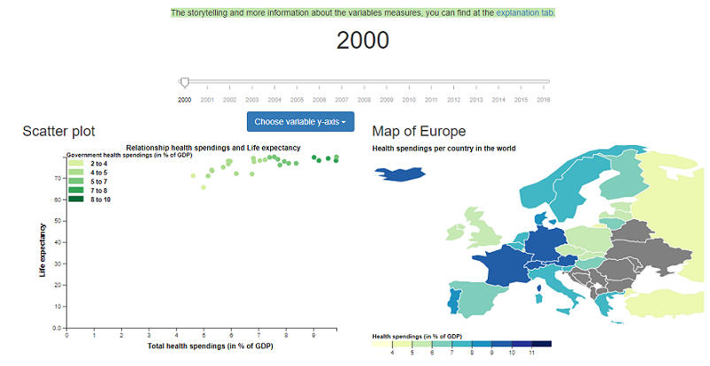

# Final report
Minor Programming 
Name: Teska Vaessen 
Student number: 11046341 
Project: Health spendings in Europe

## Description
Should a country in Europe spend more money in health? My project shows the relationship between the health spendings and the health status of countries in Europe. To show this there are 4 visualizations. First there is a scatter plot, this shows the relationship between health spendings and different kind of variables of the health status. With a drop down menu, you can switch between the different variables. The second visualization is the map of Europe, this one shows the total health spendings in a country. When you click on a country in the scatter plot or in the map of Europe, the last two charts will appear. This is a pie chart which shows the distribution of the total health spendings and donut chart which shows the distribution of the spendings of the government. All the visualizations can be updated with a new year with the time slider on top of the page.

## Technical design
### Overview
My website contains 3 pages. You start at the homepage (index.html) with a description of the problem. From there you can navigate to the visualization page (visualization.html) and the explanation page (explanation.html). The visualization.html and the explanation.html are in the **html** folder. At the explanation page the whole storytelling is told and there is more information about the data and the variables. At the visualization page all visualizations are showed. For these visualizations I made seperate JavaScript files. These are in the folder **javascript** which is in the folder **scripts**.

### main.js
This is the main file of my visualization page. This script is related to all the other javascript files. First it loads the data (the JSON-files from the folder **data** in the folder **scripts**) and it calls a function to create the whole dataset and after that it sets all the default visualizations. The default year is 2000 and the default country is the Netherlands. So it calls the create functions from the other javascript files. It also sets the on-click function for the drop down menu to update the scatter plot with a new variable, so the drop down menu can always be used. This script doesn't have his own functions, it only calls functions from other scripts, since this is the main script.

### processData.js
This script creates and returns the whole dataset for my visualizations. This script is related to the main script. It has three functions in it:
+ **function healthspendings(data)**: this functions creates an empty dataset (dictionary) and add the health spendings to the dataset.
+ **function healthvariables(healthVariables, dataset)**: this function add the health variables for the scatter plot to the dataset.
+ **function governmentspendings(governmentSpendings, dataset)**: this function add the government spendings to the dataset.

### scatterplot.js
This script contains functions to create and update the scatter plot. It is related to the main script, since there the default scatter is created. It is also related to the europemap script, since in this script the scatter plot can also be updated (see europemap.js). Besides that is also related to the piechart script, since in the scatter plot script you can update the pie charts. There are different functions in this script:
+ **function createScatter(dataset, YEAR, healthvariable)**: this function creates the default scatter and is called in the main script. First it sets the svg for the scatter plot, makes the data in the right format and then it adds the dots, the axes, the legend and the labels. In the on click of this function, the updates of the pie chart and the donut chart are called.
+ **function updateScatter(dataset, YEAR, healthvariable)**: this function updates the scatter plot. It is called in the time slider (see europemap.js). It selects the already excisting svg of the scatter and updates it. In this function is also an on click to update the pie and donut chart.
+ **function createAxes(xScale, yScale, svgHeight, margin, svg)**: this function creates the axes of the default scatter plot. This function is called in the createScatter function.
+ **function updateAxes(xScale, yScale, svgHeight, margin, svg)**: this function updates the axes of the scatter plot. It is called in the function updateScatter.
+ **function addLegend(colorScale, margin, svg)**: this function adds the color legend to the scatter plot. It is called in the createScatter functions. The legend stays the same for all scatter plots, so no update is needed.
+ **function createLabels(svg, svgWidth, svgHeight, margin, healthvariable)**: this function creates and updates the labels and title of the scatter plot. It is called in createScatter and in updateScatter.

### europemap.js
This script contains functions to create the time slider and the map of Europe. It also contains a function to update the map of Europe. It is related to the main script, since there the time slider is set and the default map of Europe is set. It is also related to the scatterplot script, since with the time slider you can update the scatter plot with a new year and with the map of Europe you can highlight a dot in the scatterplot. Besides that it is related to the piechart script, since the time slider updates the pie chart with a new year and by clicking on a country in the map the pie charts are also updated. The europemap script contains different functions:
+ **function timeslider(dataset, map)**: this functions sets the time slider. In this function you can update the scatter plot, the map of Europe and the pie charts.
+ **function worldmap(dataset, YEAR)**: this function creates the default map of Europe. Within this function you can update the, scatter plot (by highlighting a country) and update the pie charts by clicking on a country in the map.
+ **function updateMap(dataset, YEAR, map)**: this function updates the colors of the map. It is called in the timeslider function.
+ **function addLegendMap(colorScale)**: this function adds the color legend to the map. The color legend stays the same, so it is only called in the worlmap function and not in the update.

### piechart.js
This script contains the functions to create and update the pie chart and the donut chart. It is related to the main script, since there the default pie and donut charts are set. It is also related to the scatterplot script and the europemap scripts, since the pie and donut charts can be updated by clicking on a dot in the scatter plot, by changing the year in the time slider and by clicking on a country in the map. This script contains different functions:
+ **function processPie(dataset, newYear, country)**: this function formats the data so it can be used to create a pie chart. This function is called in the pieChart, donutChart, updatePie and updateDonut functions.
+ **function pieChart(dataset, newYear, country)**: this function creates an svg and sets the default pie chart. It is called in the main script.
+ **function donutChart(dataset, newYear, country)**: this function creates an svg and sets the default donut chart. It is called in the main script.
+ **function updatePie(dataset, newYear, country)**: this functions updates the pie chart with data from a new country or a new year. It is called in the time slider function, the scatter plot function, the update scatter function and the worldmap function.
+ **function updateDonut(dataset, newYear, country)**: this functions updates the donut chart with data from a new country or a new year. It is called in the time slider function, the scatter plot function, the update scatter function and the worldmap function.
+ **function arcTweenPie(a)**: this function is used for updating the slices of the pie chart and is therefore called in updatePie.
+ **function arcTweenDonut(a)**: this function is used for updating the slices of the donut chart and is therefore called in updatePie.
+ **function addText(dataset, year, country)**: this function is used to add text in the middle of the donut chart. It is called in the donutChart and updateDonut functions.
+ **function addTitle()**: this function is used to at titles to the pie and donut chart. It is called in the donutChart function.
+ **function noDonutData()**: This function shows the user there is no data about the government spendings of that specific country, so nu donut chart can be showed. This function is used in the time slider function, the scatter function, the update scatter function and the worldmap function.

### Data folder (in the scripts folder)
My data folder contains my data in CSV-file, since I downloaded these as CSV-files. And it contains JSON-files, since I converted my CSV-files to JSON-files via python.

### Python folder (in the scripts folder)
My python folder contains three scripts to convert the different variables from a CSV-file to a JSON file.

## Challenges & changes
### Data
+ Converting my data in the right format turned out to be harder than I thought. It took me a lot more days than expected. In the beginning I wanted to process all my data in python to one big dataset. After some days I decided to only convert my data to JSON files in python and process my data in javascript. With javascript this was much easier to do, so this was a good choice. I should have done that from the beginning, since now it took me too much unneccesary time.
+ After two weeks I found out that all my health status variables had no data for the year 2017. That's why I decided to delete the year 2017 from my project, since with no health status variables, there could not be any scatter plot for this year and then my storytelling would make no sense. In an ideal world, if I had more time, I would have searched for this data on the Internet for these countries, but now there was not enough time. It is sad that I only have the data until 2016, since it is already 2019 and countries need the latest data to make proper decisions.
+ I also decided not to include the BMI and alcohol and smokers data. These variables had a lot of missing countries so the scatter plot would only show a few dots. In an ideal world, if i had more time, I would have searched on the Internet for more variables. In the future I will have a better look at the beginning at my data to see if I have most of the data and not too much missing.

### Visualizations
+ A big change in this is that I first wanted to make all my visualizations below eachother, but it turned out to be more clear if I put the scatter and the map next to eachother. I think this is a good decision, since now you can click on a country in the map and see this dot in the scatter plot, which is way more clear for the user.
+ For the TopoJSON I had to import D3 version 3, instead of D3 version 5. So I decided to import both the version and use for the map of Europe version 3 and for all the other things version 5.
+ The update functions of the visualizations were a big challenge. I wanted nice transitions for this, but for all the visualizations I had problems with this and it took me a lot of time. I never used these update functions before and in the beginning I didn't really understand them, but now I do. I am glad I learned how to use these, since it is way more beautiful than deleting the old svg and adding a new one (what I was doing before). I am really happy that in the end I could fix this for all the visualizations.
+ For the x-axis of my scatter plot I wanted to do the health spendings in 1000 $ per capita. But during my project I thought it was better to do the health spendings in % of GDP, since this will show more than the spendings in dollars. Now you can compare it better with eachother.
+ First I wanted to show my visualizations for only the European Union. But I started my project with doing it for whole Europe and I decided to keep it that way, since there was no reason to do it for only the European Union. For some countries I had some missing data, which made me hesitate again, but I got the feedback that it was better to do it for whole Europe, since you will always have missing data.
+ A big challenge I faced during the whole project was getting the data in the right format for the different visualizations. My total data in the JSON file was really nice and clear, but for every figure your data needs to be in another format. This took me a lot of time, and now I know I ALWAYS have to take a look in which way your data needs to be formatted.

### Colours
+ In the beginning I was planning to use the same color scale for all my visualizations. But I found out that it was really confusing, since the visualizations where showing different variables, so I would not be clear for the user. I decided to use a lot of blue and green, since I think this 'fits' the theme health. I decided to use really different colors for the donut chart, since this chart is showing whole other variables, so to make this clear I chose really different colors.

### Interactive elements
+ I decided to put my time slider on top of the page. I think is a nice place, since it updates all the visualizations and this way you have a clear overview. I could also have done it in the middle of the visualizations. I tried this, but it was really messy. So I am happy with where it is now.

## Reflection
When I have a look at my design document, I can see that I implemented all the features that I wanted to implement. The only thing I did not is all the health status variables. I think this is a pity and I could have prevent this by having a better look in the beginning at my dataset. If I would have more time I would have searched longer on the Internet for good representable variables for the health status of a country. 
What also could have been prettier is the visualization page in total. I also said in my proposal that a hard part of my project would be to give a clear visualisation per country of all statistics together. I think this could have been better, since now you have to scroll down, but this is a minor issue. In my proposal I also said that it would be hard for me to design a new website, since I never did this before. I think I did a great job, since it was my first time. I learned a lot from this.
Overall I am happy with the end result and that I implemented all the features I wanted to implement.
