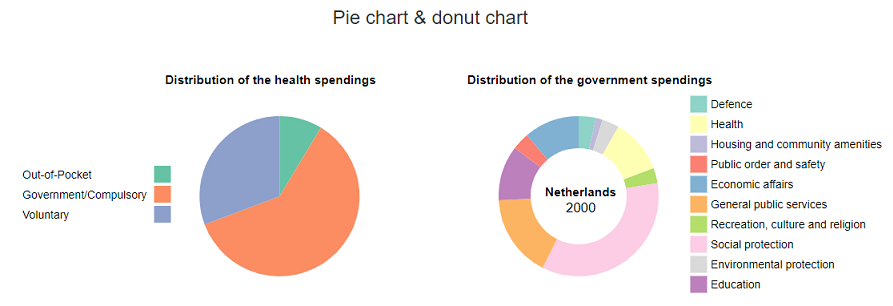

# Final report
Minor Programming 
Name: Teska Vaessen 
Student number: 11046341 
Project: Health spendings in Europe

## Description
Should a country in Europe spend more money in health? My project shows the relationship between the health spendings and the health status of countries in Europe. To show this there are 4 visualizations. First there is a scatter plot, this shows the relationship between health spendings and different kind of variables of the health status. With a drop down menu, you can switch between the different variables. The second visualization is the map of Europe, this one shows the total health spendings in a country. When you click on a country in the scatter plot or in the map of Europe, the last two charts will appear. This is a pie chart which shows the distribution of the total health spendings and donut chart which shows the distribution of the spendings of the government. All the visualizations can be updated with a new year with the time slider on top of the page.

