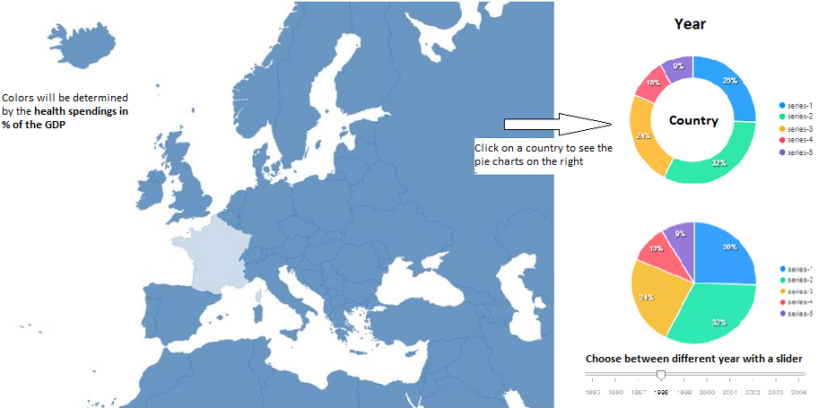

# Project Proposal
Name: Teska Vaessen

Student number: 11046341

Should the government of a country spend more money on health?

## Problem statement
Some countries in the European Union (EU) spend more money on health than other countries. Besides that some countries make health insurance compulsory for their citizens, while other countries don't. But how much effects the health spendings the health status of a country? This visualization should help the government of EU countries to see if they should spend more money on health.

<!-- Some countries in the European Union have a compulsory insurance for their citizens, but not all countries. This visualization should help citizens of the EU to get to know if you should spend more money on health (insurance). But it is also necessary for the governments of the countries to see how healthy their citizens are and if they should spend more money on health (and maybe make health insurance compulsory or not). -->

## Solution
To solve this problem I will start with the most important question: How much effect does health spendings have at the health of the citizens of a country? I will visualize this relationship between health spendings and health statistics (e.g. BMI, alcohol and tabacco consumption, perceived health status, life expectancy, mortality rate) with multiple scatterplots. On the x-axis I will show the total health spendings per 1000 capita. The color of the dots will be determined by how many percent of the total health spendings come from the government. For the y-axis you can choose between multiple variables with a (drop-down) menu.

<!--  -->

After we determined the relationship between health spendings and the health statistics, it is time to get more insight in the spendings of a country. How much does a country already spend on health and is there even a possibility to spend more on health?
To get the answer to this question I will first make a map of Europe where you can see how much a country spends on health (in % of GDP). When you click on a country in the map you will see a pie chart of that specific country of the distribution of the health spendings (voluntary/compulsory etc.), but you will also see in another pie chart how much they spend on other sectors. With a slider you can choose between the different kind of years in the data set. For an example, see the sketch below:

With these visualizations a country should be able to see if the citizens in their country are healthy compared to other countries and if there is room for improvement. When they need improvement they can see on which specific health problem they should spend more money in and also where they can cut down the money from.

### Main features
+ Scatter plot of relationship between health spendings and health statistics (different variables) (**MVP**)
+ (Drop-down) menu to choose the variable for the health statistics (**MVP**)
+ Also choose between different years (**optional**)
+ Put another variable in the size of the dot to make things more clear (**optional**)
+ Show more information about the health equipment/resources in a country, e.g. number of hospital beds, doctors and nurses (**optional**)
+ Map of Europe which shows the health spendings (in % of GDP) of the countries (**MVP**)
+ When you click on a country show two pie charts: first with the distribution of the health spendings (maybe a stacked bar chart a better idea?) and second how much they spend on different sectors (**MVP**)
+ Choose with a slider between different years for the country's data (**MVP**)

## Prerequisites
### Data sources
I have to combine all variables into one or two datasets. I will get my data from [OECD Health](https://data.oecd.org/health.htm)
+ [Health spendings](https://data.oecd.org/healthres/health-spending.htm)
+ [General government spending](https://data.oecd.org/gga/general-government-spending.htm#indicator-chart)
+ [Alcohol consumption](https://data.oecd.org/healthrisk/alcohol-consumption.htm)
+ [Smokers](https://data.oecd.org/healthrisk/daily-smokers.htm#indicator-chart)
+ [Life expectancy](https://data.oecd.org/healthstat/life-expectancy-at-birth.htm)
+ [Potential years of life lost](https://data.oecd.org/healthstat/potential-years-of-life-lost.htm#indicator-chart)
+ [Overweight](https://data.oecd.org/healthrisk/overweight-or-obese-population.htm)

### External components
+ D3
+ D3-tip
+ TopoJSON
+ (Maybe D3-legend)

### Review similar visiualization
A kind of similar visualization is one from [healthdata](https://vizhub.healthdata.org/fgh/). They also show the spendings in a world map, but here you can also choose for the world map between the different kind of spendings. They chose to make a stacked bar chart to show the distribution of the health spendings. But since I want to show it per year I think a pie chart will make this more clear. They also don't show the health statistics of a country, but I think that is necessary because a country should know how healthy their country is.

### Hardest parts
The hardest part of implementing my application will be to give a clear visualisation per country of all statistics together. I have a lot of different kind of variables and it will be hard to show them all in a decent way. Besides that I am new at designing website in a nice and handy way. This will also be a challenge for me. It will also be hard to get a clear dataset with all the different variables. I have to combine it in a good way. In the first week I have to think about what is handy for later.

## Reverences
+ [Map Europe](https://stackoverflow.com/questions/37635547/interactive-graph-of-europe-using-d3)
+ [Pie charts](https://apexcharts.com/javascript-chart-demos/pie-charts/)
+ [Time slider](https://bl.ocks.org/johnwalley/e1d256b81e51da68f7feb632a53c3518)
