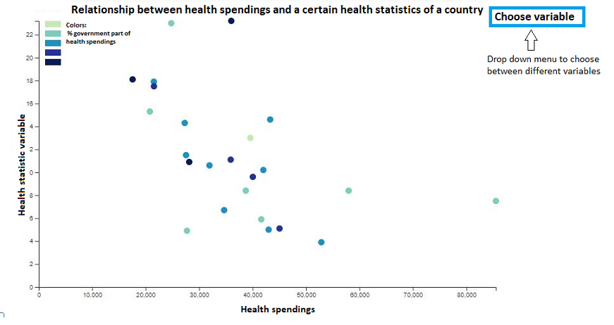

# Project Proposal
Name: Teska Vaessen

Student number: 11046341

How much influence has health spendings on the health status of a country?

## Problem statement
Some countries in the European Union have a compulsory insurance for their citizens, but not all countries. This visualization should help citizens of the EU to get to know if you should spend more money on health (insurance). But it is also necessary for the governments of the countries to see how healthy their citizens are and if they should spend more money on health (and maybe make health insurance compulsory or not).

## Solution
To solve this problem I will first make a map of Europe where you can see how much a country spends on health. When you click on a country in the map you will see a pie chart of that specific country of the distribution of the health spendings (voluntary/compulsory etc.), but you will also see in another pie chart how much they spend on other sectors. With a slider you can choose between the different kind of years in the data set. For an example, see the sketch below:

Below the world map I will also show the relationship between health spendings and health statistics (e.g. BMI, alcohol and tabacco consumption, perceived health status, life expectancy, mortality rate) in a scatter plot. With a (dropdown) menu you can choose from which variable you want the relationship with the health spendings.

### Optional
It is also possible to show these variables in stacked barcharts, where you can see the difference between men and women. So then it is more clear for the EU citizens whether they should spend more on health or not (depending on their sex).
Besides that it is also optional to show more statistics about the health resources of a country, for example the number of doctors, nurses and hospital beds. This will give more insight in the health statistics of a country.

## Prerequisites
### Data sources
I have to combine all variables into one dataset. I will get my data from OECD Health: https://data.oecd.org/health.htm
+ Health spendings: https://data.oecd.org/healthres/health-spending.htm
+ General government spending: https://data.oecd.org/gga/general-government-spending.htm#indicator-chart
+ Alcohol consumption: https://data.oecd.org/healthrisk/alcohol-consumption.htm
+ Smokers: https://data.oecd.org/healthrisk/daily-smokers.htm#indicator-chart
+ Life expectancy: https://data.oecd.org/healthstat/life-expectancy-at-birth.htm
+ Potential years of life lost: https://data.oecd.org/healthstat/potential-years-of-life-lost.htm#indicator-chart
+ Overweight: https://data.oecd.org/healthrisk/overweight-or-obese-population.htm

### External components
+ D3
+ D3-tip
+ TopoJSON
+ (Maybe D3-legend)

### Review similar visiualization

### Hardest parts
The hardest part of implementing my application will be to give a clear visualisation per country of all statistics together. I have a lot of different kind of variables and it will be hard to show them all in a decent way. Besides that I am new at designing website in a nice and handy way. This will also be a challenge for me. It will also be hard to get a clear dataset with all the different variables. I have to combine it in a good way. In the first week I have to think about what is handy for later.

## Reverences
+ Map Europe: https://stackoverflow.com/questions/37635547/interactive-graph-of-europe-using-d3
+ Pie charts: https://apexcharts.com/javascript-chart-demos/pie-charts/
